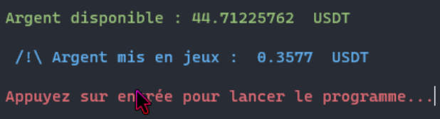
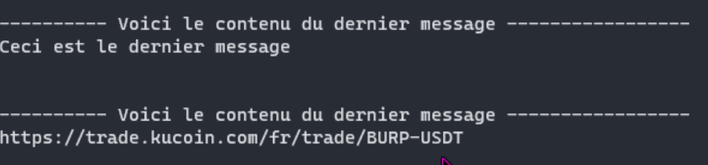
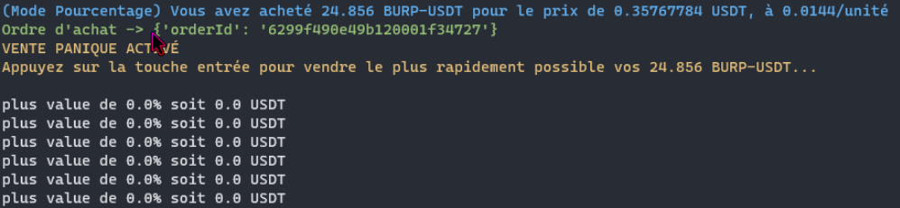
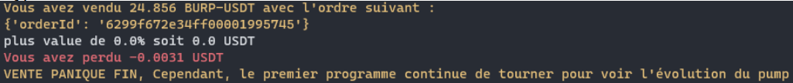
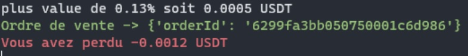
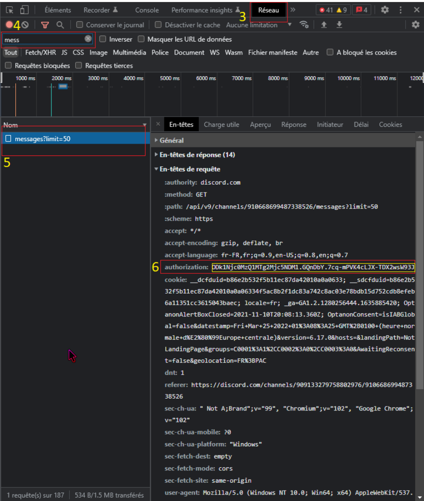

**/!\ CLAUSE DE NON-RESPONSABILITÉ /!\
Ce programme ne constitue pas de conseil en investissement.
Vous êtes responsable de vos investissements.
Renseignez-vous bien avant d’investir !** 

**Information sur le programme :** 

Au lancement du programme, il marquera :

**Argent disponible** : C’est l’argent disponible en USDT sur votre compte  kucoin dans le portefeuille trade.  

**Argent mis en jeu** : il est calculé avec l’investissement en pourcentage que  vous avez mis dans le document de configuration. 

Par exemple, vous avez 100 USDT disponibles, et vous avez mis 20% de votre argent disponible, alors le programme marquera que vous mettez en jeu 20 USDT. 

Quand vous appuierez sur la touche entrée, le programme se lancera. 

Il marquera le dernier message tant qu’il ne trouve pas le nom de la cryptomonnaie. 

Dès qu’il trouve une cryptomonnaie, il achètera avec l’argent mis en jeu au début. 

Ce qui prouve qu’il a bien acheté, c’est l’orderId, s’il n’y est pas, c’est qu’il n’a pas acheté. 

Vente panique, c’est un deuxième programme qui tourne en même temps que le premier dans la même invite de commande. Il permet en cas de problème, de faire simplement « entrée » dans l’invite de commande et il vendra directement les cryptomonnaies achetées au début. 

Si on n’utilise pas le programme « Vente panique » le programme affichera la plus-value en pourcentage et le bénéfice en USDT. Dès que le pourcentage affiché et supérieur ou égal à celui marqué dans le fichier de configuration, il vendra les cryptomonnaies achetées au début. 

Dans cet exemple, j’ai mis dans le document de configuration : 

Argent mis en jeu : 0.8 (soit : 0.3546 USDT) 

Bénéfice en pourcentage : 0.1 %

On peut voir que ça a bien été vendu, car il y a l’ordre de vente marqué. Le calcul pour savoir si on a gagné ou perdu est celui-ci : 

(0.35452 - 0.3543 - 0.0007- 0.0007 = -0.00118) 

Montant en USDT de la vente de la crypto – montant de l’achat de la crypto – les frais de transaction. 

**Information sur le document texte « config.txt » :** 

**Investissement en pourcentage :** 

Le programme prendra comme base la valeur disponible en USDT dans votre portefeuille 'trade' sur kucoin, la valeur va de 0 à 100. 

**Bénéfice en pourcentage :** 

C'est le bénéfice que vous souhaitez gagner en pourcentage. Le logiciel vendra la cryptomonnaie achetée au début et se basera sur le prix d'achat pour le gain en pourcentage, si vous entrez une valeur trop haute, c'est possible que ça n'atteigne pas ce seuil et donc le programme ne vendra pas et vous pourrez perdre une partie de votre investissement voire la totalité. 

La valeur peut aller de 0 à autant que vous le souhaitez. 

**API KUCOIN :** 

Tuto pour créer l'api :[ https://www.youtube.com/watch?v=cHbcUNaw5nA&t=65s&ab_channel=TimDoyle ](https://www.youtube.com/watch?v=cHbcUNaw5nA&t=65s&ab_channel=TimDoyle)

**DISCORD ID:** 

Ce sera le canal discord où on récupéra les messages : 

Il faut obliatoirement que le compte discord soit dans le serveur discord en question pour pouvoir lire les messages. Exemple : "

Après channels dans l'URL, il aura deux nombres "/channels/A/B". 

Le nombre A est l'id du serveur, ce n'est pas celui-là qui nous intéresse. 

Le nombre B est l'id du salon, sur le même serveur discord il change en fonction du salon dans lequel vous vous trouvez. Cliquez sur le salon où vous voulez récupérer le nom de la cryptomonnaie et copiez le nombre B dans le fichier de configuration. 

**COOKIE DE CONNEXION :**

Pour trouver les cookies, il faut :  

1. se connecter au compte discord depuis un navigateur  internet.  
1. ouvrir le DevTools (F12).  
1. aller dans l'onglet "Réseau".  
1. dans "Filter" marquez : "message", normalement, vous ne  verrez que "messages?limit=50", Cliquez dessus.  
1. Dans "En-têtes de requête" normalement à la 8ème ligne, il  y aura "authorization".  
1. copiez la valeur de "authorization" entourer en jaune dans  le screen dans le fichier de configuration.  

**Information sur le document texte « coins.txt » :** 

Quand on récupère le nom de la cryptomonnaie, le programme va vérifier si elle n’est pas présente pas le documents coins.txt. Deux cas sont possibles : 

Elle est présente dans le document : 

Le programme s’arrêtera en disant qu’il y a déjà eu un achat avec cette cryptomonnaie. 

Si elle n’est pas présente : 

Il achètera la cryptomonnaie. 
